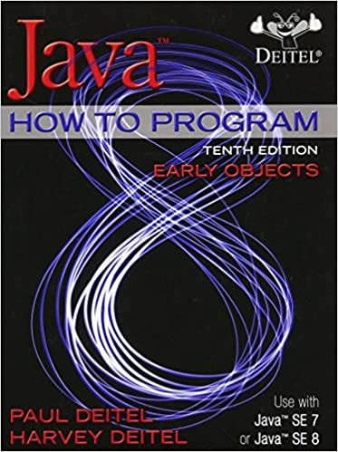

# Java How To Program (Early Objects), 10th Edition
 

	

 
 

# Description
I have written book source codes and answers to exercises
 
 

# Author github repository
[Here](https://github.com/pdeitel/JavaHowToProgram10eEarlyObjectsVersion) is the github repository of author for this book.
 
